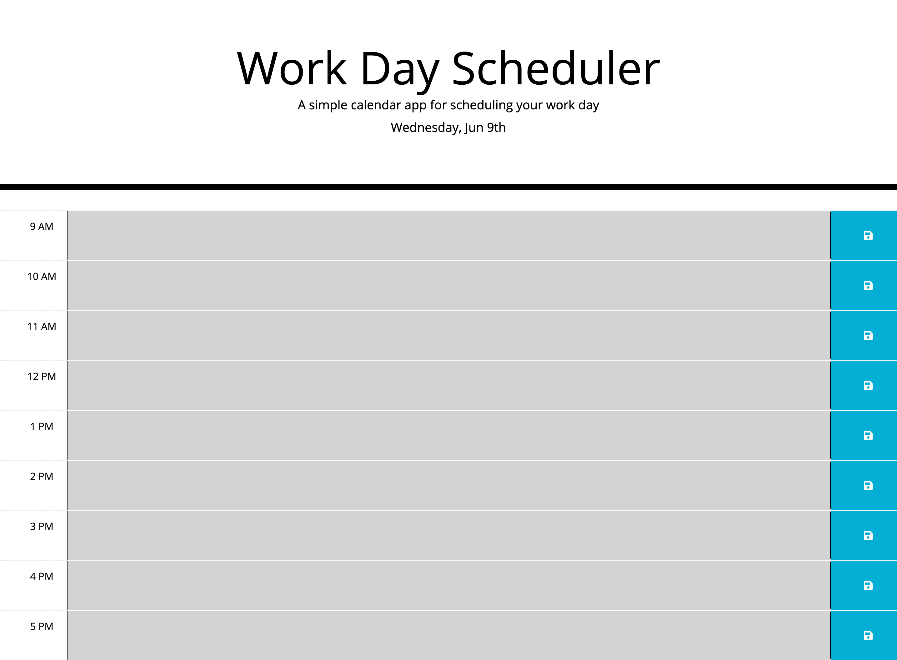

# work-day-scheduler
A simple work day calendar application featuring dynamically updated HTML and CSS powered by jQuery.

# Motivation for this project

learn how to create a user friendly daily planner calender application by modifying and creating dynamically updated HTML and CSS powered by jQuery.

# Reason for this project 

Complete the building of a user friendly calendar application that allows the addition of important events, features CSS powered by jQuery, js and updated HTML

# What I learned from this project 

In this activity I learnt:

* How to start HW assignemnets; step by step breaking down of the acceptance criteria and the importance od commenting especially after teh code has been erased and you cannot remeber what you wanted to add. 

* The importance of stackoverflow when trying to figure out what the inspect mistake made means/wants you to correct what you need fixed. 

* How to use teh Moment.js library to work with date and time. 

* How to store and retrieve data using the browser's local and session storage.

* How to implement jQuery UI to make a webpage more user-friendly.

https://conso97.github.io/med-quiz/

